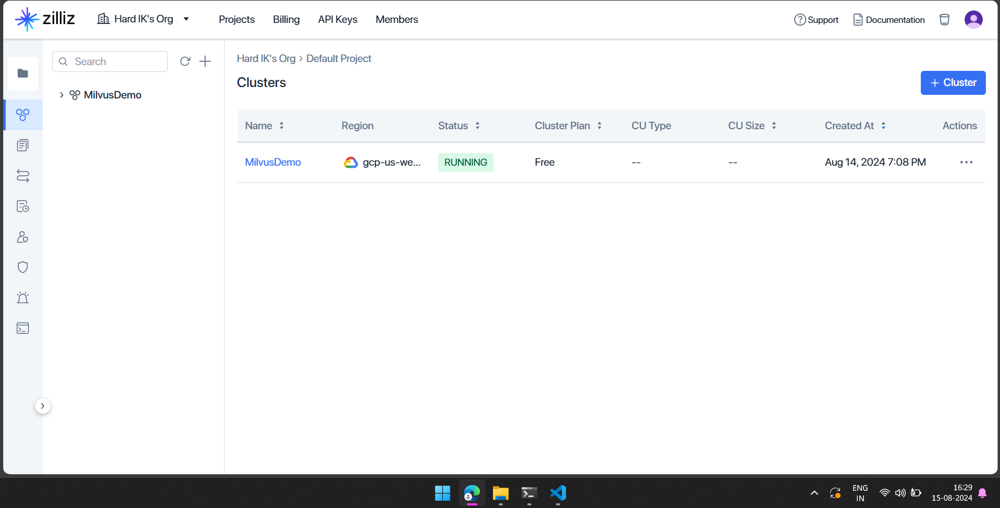
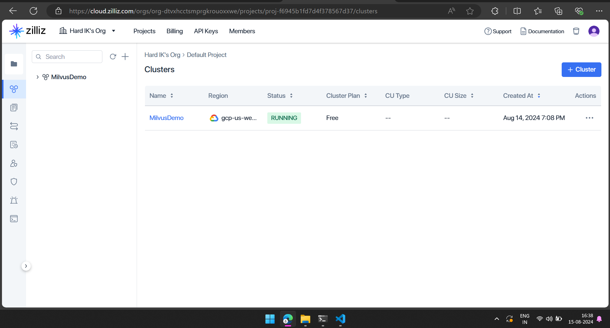
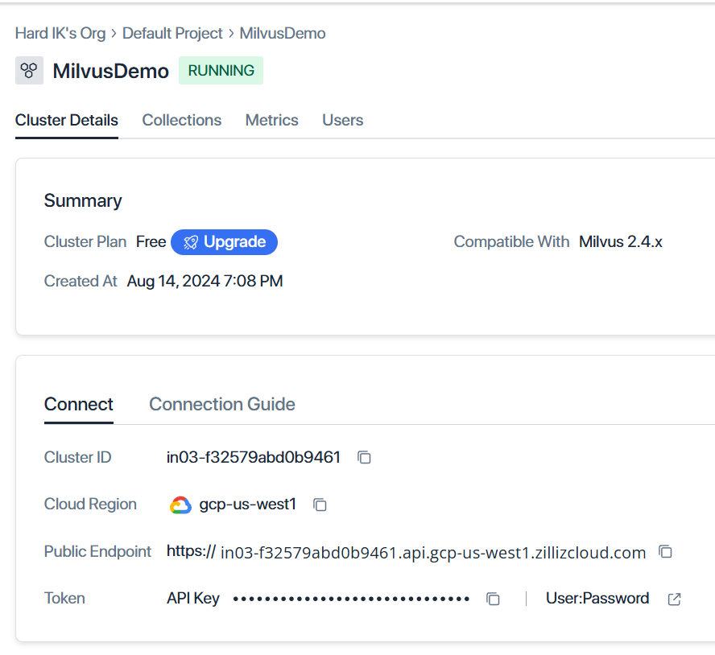

# To create New Cluster on Milvus 
1. First signup for cloud version on [zilliz cloud](https://cloud.zilliz.com/signup)
2. You will see a page like this now create 
Click on to project tab on top. 

3. If there is default project then create cluster in that project.
OR
3. Create a new project named with any name. and create a cluster in that project.

4. To find the Access token and uri.
Click on Cluster you have created. In my case the cluster name is MilvusDemo.

5. Now go to cluster details you will see
Public Endpoint : `uri`
Token : `access_token`

copy them as it is and paste them into run_milvus_pipeline code. in `milvus_uri` and `access_token` respectively.

# To search Vector into that Cluster.

